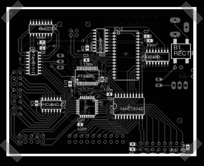

# Mega8 逻辑测试仪

> 原文：<https://hackaday.com/2007/09/12/mega8-logic-tester/>

【Ast】送来了 [his](http://www.microlaboratories.com/?page_id=77) [时间采样逻辑分析仪](http://www.microlaboratories.com/?page_id=77)(德语中，所以用[鱼](http://babelfish.altavista.com/))基于一个 Atmel Mega8 和一个 FT232 USB 接口和几个逻辑芯片。它可以在内存中存储时间捕捉，然后通过 USB 将它们上传到 PC。看起来是高级逻辑测试的好工具。

*   [永久链接](http://www.microlaboratories.com/?page_id=77)