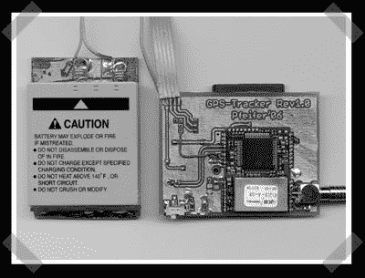

# 另一个 GPS 记录器

> 原文：<https://hackaday.com/2007/09/13/another-gps-logger/>

【leatix】前几天看到气象气球记录器后，送来了[这个](http://thomaspfeifer.net/gps_tracker.htm)。在这种情况下，它是围绕一个 Mega8 构建的，将日志存储在 MMC/SD 卡上，并使用锂离子电池运行。翻译它对我来说有点困难，但是如果你觉得幸运的话可以试一试。

*   [永久链接](http://thomaspfeifer.net/gps_tracker.htm)