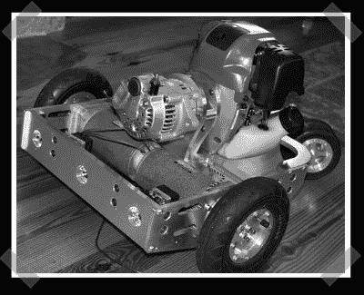

# 混合机器人

> 原文：<https://hackaday.com/2007/09/21/hybrid-robot/>

【科利】送来[这个](http://forums.parallax.com/forums/default.aspx?f=25&m=217955)港口的喷气背包换螺旋桨 uc，但是当我开始四处打探的时候我发现了这个可爱的[混合机器人](http://forums.parallax.com/forums/default.aspx?f=21&p=2&m=151769)平台。一个四冲程 Robin/Subaru 35cc 电机驱动一个汽车交流发电机，根据需要提供几乎无限的(在机器人世界中)电力。休息后点击视频，观看快速遥控演示，了解发动机的声音有多大。不经意间，我认出了用来连接发动机和交流发电机的 lovejoy 耦合器。

顺便说一下，这个机器人出现在最新的[机器人杂志](http://www.botmag.com/)上，如果你讨厌阅读论坛，你可以在那里获得详细信息。

<object width="400" height="325"><param name="movie" value="http://www.youtube.com/v/iXPhkvJw6BQ"><param name="wmode" value="transparent"></object>

*   [永久链接](http://forums.parallax.com/forums/default.aspx?f=21&p=2&m=151769)