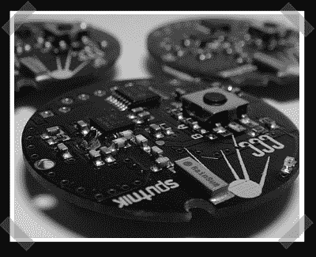

# OpenBeacon:主动 RFID 平台

> 原文：<https://hackaday.com/2007/10/01/openbeacon-active-rfid-platform/>

OpenBeacon 项目是一个开放源代码的硬件和软件有源 RFID 设备。OpenBeacon 标签由 2.4GHz 收发器和 PIC16F684 组成。该项目的一个用途是创建 [CCC Sputnik](http://www.openbeacon.org/ccc-sputnik.0.html) 来展示使用数据挖掘从大型跟踪系统中收集的信息的缺点。选择参与并佩戴人造卫星标签的人是自愿的，他们这样做是为了创建一个材料数据库以供进一步研究。第一版标签的硬件[原理图](http://www.openbeacon.org/dl/23C3/OpenBeacon.pdf) (PDF)以及所有版本的[固件](http://www.openbeacon.org/downloads.0.html)已经发布。强烈鼓励进一步创造性地使用 OpenBeacon 项目。

提醒一下，24C3，第 24 届混沌通信大会，[征集参与](http://events.ccc.de/congress/2007/)将于 10 月 12 日结束。今年的主题包括所有硬件项目，更具体地说，是蒸汽朋克主题的提交。查看 [CCC 活动](http://events.ccc.de/)博客了解更多信息。

*   [永久链接](http://www.openbeacon.org/)