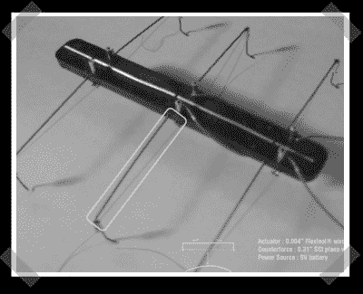

# 带有形状记忆合金丝的呼吸壁

> 原文：<https://hackaday.com/2007/10/03/breathing-walls-with-shape-memory-alloy-wire/>

当你需要一些东西安静地弯曲或移动时，不要低估 SMA(或[形状记忆合金](http://en.wikipedia.org/wiki/Shape_memory_alloy))。建筑师大卫·本杰明(David Benjamin)和杨秀英(Soo-in Yang)的“活玻璃”项目记录了一个实验，用 SMA 线和微控制器建造互动、灵活、“会呼吸”的墙壁。虽然他们使用基本的邮票，该项目可以很容易地扩展到更具成本效益的大型表面的微控制器。这个项目用每个原型制作步骤的[视频](http://www.thelivingnewyork.com/lg/prototype9.avi) (AVI)做了很好的记录，甚至包括最终被废弃的想法。即使你没有建立一个交互式鳃的墙，这个项目也应该给你很多关于使用嵌入半柔性材料中的 SMA 线的想法。

*   [永久链接](http://www.thelivingnewyork.com/lg.htm)