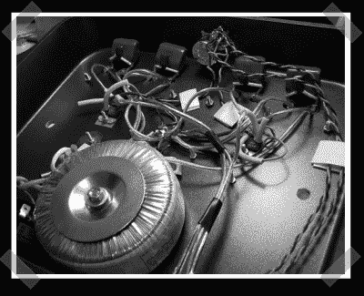

# 烤盘音频放大器

> 原文：<https://hackaday.com/2007/10/05/roasting-pan-audio-amplifier/>

当你的放大器需要一个坚固、无振动的底盘时，只需要一个[烤盘](http://diyaudioprojects.com/Chip/Synergy-LM3875-Gainclone/index.htm)就可以了。我曾用浇铸水泥制作超重低音扬声器，但用螺栓将烹饪锅固定在沉重的木制案板上是一种廉价的方式，可以获得坚硬的表面来制作音频设备。[Mark]使用的放大器电路并不复杂，但它能完成工作。“无氧铜线”和“纯银线”是不需要的，只要确保你有一个坚实的机械连接。换句话说，只要给你的电线上锡，在两端弯成小的“u”形，把它们钩在一起，然后在加热的两端涂上焊料。或者，在镀锡前，将绞合线的两端保持相互平行并缠绕在一起，然后焊接。在移动电线接头的同时，用万用表测试一切，以确保没有弱连接。现在你不会浪费你的钱在炒作电缆材料。

感谢[Gio](他似乎也有一些个人的[音频项目](http://diyaudioprojects.com/Tubes/50EH5/50EH5.htm))的提示。

*   [永久链接](http://diyaudioprojects.com/Chip/Synergy-LM3875-Gainclone/index.htm)