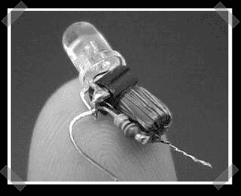

# 焦耳盗 LED 驱动器

> 原文：<https://hackaday.com/2007/10/10/joule-thief-led-driver/>

【bird 603568】送来了[这个](http://www.emanator.demon.co.uk/bigclive/joule.htm)可爱的小 LED hack，它可以从仅仅 1.5 伏驱动白光 LED。该电路由一对缠绕在铁氧体磁芯上的线圈、一个电阻和一个 NPN 晶体管组成。他指出，即使在 0.35 伏的电压下，这种电路仍能工作。图中的版本甚至小到可以放入普通的手电筒灯座中。

*   [永久链接](http://www.emanator.demon.co.uk/bigclive/joule.htm)