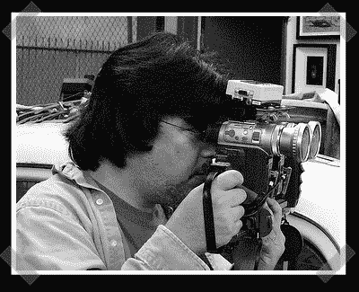
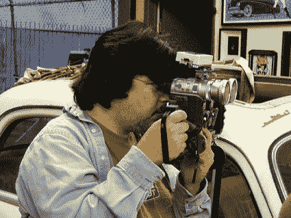
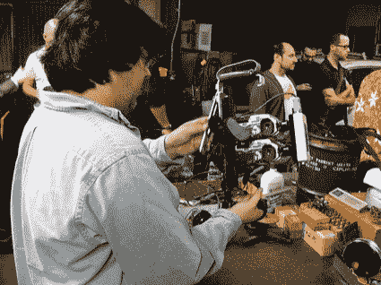

# 消费类相机的 3D 视频

> 原文：<https://hackaday.com/2007/10/14/3d-video-with-consumer-cameras/>

在仔细阅读我们在 [Hooptyrides，Inc .巡回演出的照片时](http://www.hackaday.com/2007/10/14/hooptyrides-inc-open-house/)你可能已经注意到了【Eric Kurland】的双手立体视觉装置。它由两台消费级索尼 DV 摄像机构成。使用两个独立的相机来制作立体图像或视频的问题是，由于帧速率的差异，缺乏时钟同步会使对象看起来偏离它们的真实位置。来解决这个问题达米尔·弗兰？我？开发了 [3D LANC 大师](http://www-e2.ijs.si/3DLANCMaster/)。它从其中一个摄像头读取晶体频率，并使用索尼的 LANC 协议写入另一个摄像头的 ram。这种持续的监控使时钟保持在+/-3 毫秒之内。控制盒还有开机、变焦和同步录制的按钮。3D LANC 主图是完全开源的，可以和大量的索尼相机一起工作。休息之后我们有更多 Eric 的照片。

*   [永久链接](http://www-e2.ijs.si/3DLANCMaster/)