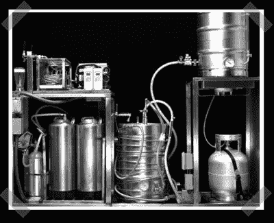

# 家庭酿造啤酒厂

> 原文：<https://hackaday.com/2007/10/16/home-brewing-beer-brewery/>

上个月在科普上看到了[这个](http://www.popsci.com/popsci/how20/832ce78a72494110vgnvcm1000004eecbccdrcrd.html)，但是有段时间没上线。这个(几乎)一体化的酿酒厂是由[约翰·卡内特]建造的。它什么都做，但目前需要麦芽提取物。它煮沸麦芽汁，冷却发酵，将啤酒送到小桶，最有趣的是，在啤酒流出水龙头之前，用冷板冷却啤酒。我很确定他们用的是珀耳帖结，但我想确定一下。感谢[Nate]无意中提醒了我他送来一个南瓜来酿造啤酒[！](http://www.flickr.com/photos/cog_nate/sets/72157602400060222/)

*   [永久链接](http://www.popsci.com/popsci/how20/832ce78a72494110vgnvcm1000004eecbccdrcrd.html)