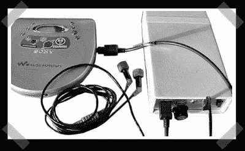

# 光学耳机放大器

> 原文：<https://hackaday.com/2007/10/19/optical-headphone-amp/>

看起来[这只](http://headwize.com/projects/showfile.php?file=ifkovic_prj.htm)已经出现一段时间了，但这并没有减少它的威慑力。[Andrija]制造了这款便携式 DAC/耳机放大器组合。它接收光音频输入，并通过 ADI 公司的 16 位/96khz 解码器 AD1866 进行馈送。之后，音频通过运算放大器式耳机放大器电路提高音量。

旁注:我写了一些简短的笔记在我今天得到的助手 LX 上，如果你喜欢那种东西的话。

*   [永久链接](http://headwize.com/projects/showfile.php?file=ifkovic_prj.htm)