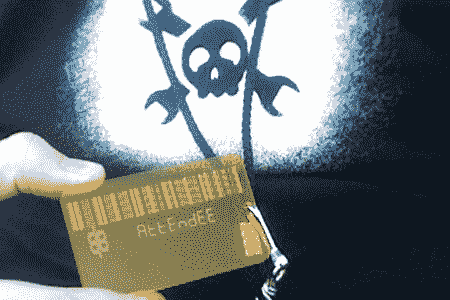

# ToorCon 9:隐密船场

> 原文：<https://hackaday.com/2007/10/19/toorcon-9-crypto-boot-camp/>

[Rodney Thayer]做了一个关于加密技术的两小时的研讨会。它旨在为观众提供与供应商打交道的实用知识。他给出了一些选择加密的经验法则。按照优先顺序，当进行对称密钥加密时:使用至少 128 位密钥的 [AES](http://en.wikipedia.org/wiki/Advanced_Encryption_Standard) ，如果不是 3 密钥 Triple-DES，则使用 128 位密钥的最后一个 RC4。对于哈希: [SHA](http://en.wikipedia.org/wiki/SHA) 256 首选，做不到更好就 SHA 1，做不到 SHA 就 MD5。对于公钥: [RSA](http://en.wikipedia.org/wiki/RSA) 使用至少一个 2048 位的密钥。这些名单中的首选之所以被选中，是因为它们经受住了多年的审查。谈话的一个主题是永远不要推出自己的加密算法或购买别人的。专有算法总是被破解，比如我们今年早些时候谈到的 [GSM A5 加密](http://www.hackaday.com/2007/08/11/cccamp-2007-gsm-a5-cracking/)。