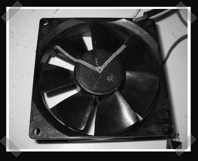

# 频闪仪 LED 风扇钟

> 原文：<https://hackaday.com/2007/10/26/stroboscope-led-fan-clock/>

【sprite _ TM】发来了他的[最新](http://spritesmods.com/?art=ledfanclock&f=had)小冒险之一——我喜欢它。为了创造他的[频闪观测仪](http://en.wikipedia.org/wiki/Stroboscope)风扇时钟，他将一对红色和绿色的时钟指针放在一个标准的 PC 风扇上(我喜欢 Panaflo 风扇)，然后他建立了一个电路来频闪一个 RGB LED，以在旋转的风扇上创建一组虚拟时钟指针。在一些晶体管驱动 led 的帮助下，ATTiny2313 完成了所有工作。

*   [永久链接](http://spritesmods.com/?art=ledfanclock&f=had)