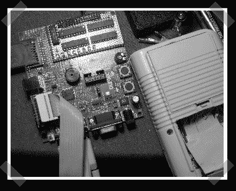

# USB Gameboy 墨盒项目

> 原文：<https://hackaday.com/2007/10/28/usb-gameboy-cartridge-project/>

【荷西】认为[小音 DJ](http://www.littlesounddj.com/lsd/) 太贵太难找。现在他正在[尝试](http://www.8bc.org/forums/viewtopic.php?pid=11782#p11782)制造一种廉价的 USB 可编程游戏机盒。目前他正在使用 LPC2148 开发板。还不清楚他想说什么。他当然想增加 USB 编程，但看起来他也在尝试破解 mp3 解码器。【更新:对，我知道怎么拼墨盒！]

*   [永久链接](http://www.8bc.org/forums/viewtopic.php?pid=11782#p11782)