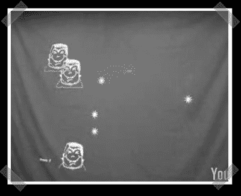

# PySight Post 万圣节娱乐

> 原文：<https://hackaday.com/2007/11/02/pysight-post-halloween-entertainment/>

【约翰】发来了他在万圣节一起黑的这个装置。他使用了一台内置摄像头的 MacBook Pro，一台投影仪，一张床单，一个适合孩子的激光笔，以及一个由 PySight 和 PyGame 拼凑而成的组合。结果是一个相当简单射击游戏[马希](http://www.homestarrunner.com/malloween.swf)。不错！

*   [永久链接](http://www.kulturblog.com/2007/11/marshie-attacks-halloween-interactive-driveway-activity/)