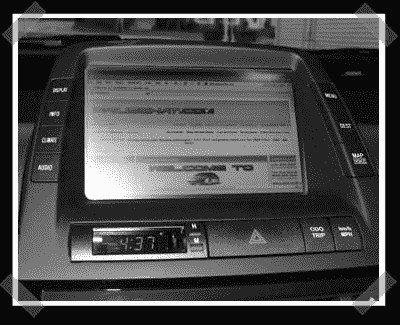

# GVIF(普锐斯)显示器黑客

> 原文：<https://hackaday.com/2007/11/06/gvif-prius-display-hacking/>

这几乎是缺乏 hack，却让我 bug。2006 年，丰田改变了普锐斯液晶显示屏上的视频接口。新系统使用 [GVIF](http://www.sony.net/Products/SC-HP/application/gvif/overview/index.html) (千兆视频接口)，而不是之前的 RGB。迄今为止，成功仅限于一些早期的商业设备。考虑到喜欢偷车的人的数量，我希望看到一些 diy 解决方案的开发。该行业似乎正在以与 HDMI 相同的方式推动 GVIF 用于家庭影院——它甚至支持 [HDCP](http://en.wikipedia.org/wiki/HDCP) 。遗憾的是，目前看来[多显示器](http://www.spasalon.com/prius/)仍然是最好的选择。

*   [永久链接](http://priuschat.com/index.php?showtopic=27375&st=0)