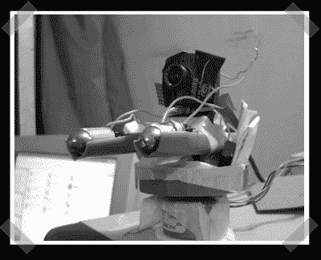

# 激光摄像机跟踪

> 原文：<https://hackaday.com/2007/11/10/laser-camera-tracking/>

【a shish】还在玩他的激光。他最新的黑客技术是一个基于双激光跟踪摄像机的。他将相机安装在一个简单的[并行端口控制步进电机](http://ashishrd.blogspot.com/2007/09/computer-controlled-stepper-motor.html)上。本质上，如果相机失去了任何一个激光的跟踪，它会跟踪以定位物体丢失的边缘。我可能会选择红外线以减少视网膜损伤的机会…

*   [永久链接](http://ashishrd.blogspot.com/2007/11/object-tracking-using-camera-and-lasers.html)