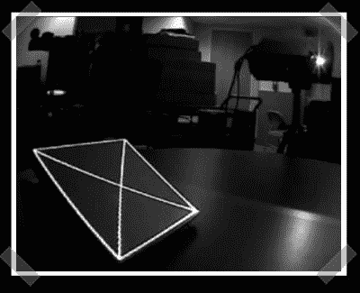

# 自动投影仪校准

> 原文：<https://hackaday.com/2007/11/15/automatic-projector-calibration/>

【张诗钟·李】[发来了他的](http://www.cs.cmu.edu/~johnny/academic/proj4.pdf) (pdf)牛逼的投影仪校准项目。通过添加嵌入一些光纤，馈入一组 USB 连接的光传感器，他的团队软件可以确定每个传感器的精确像素位置。一旦确定了位置，就可以动态调整投影图像来固定屏幕。该技术可用于将多个投影仪拼接在一起，甚至校准图像以投影到三维模型上。我知道一些家庭影院迷会喜欢这个系统来校准他们的 CRT 投影仪。

这是一个如此优秀的项目，我想给它应有的荣誉——它是由[Johnny C. Lee]、[Paul H. Dietz]、[Dan Maynes-Aminzade]、[Ramesh Raskar]和[Scott E. Hudson]开发的。

休息后请务必观看视频演示！

<object width="425" height="355"><param name="movie" value="http://www.youtube.com/v/XgrGjJUBF_I&amp;rel=1"><param name="wmode" value="transparent"></object>

*   [永久链接](http://www.cs.cmu.edu/~johnny/academic/proj4.pdf)