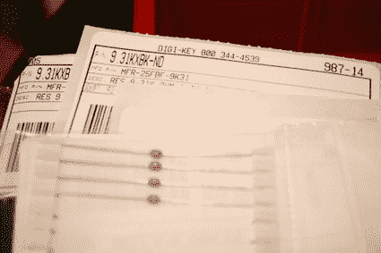
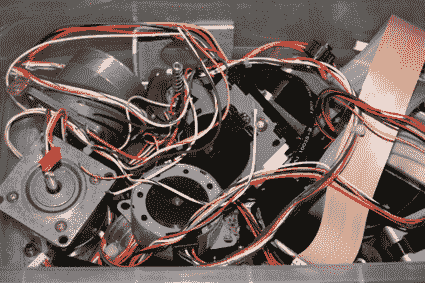
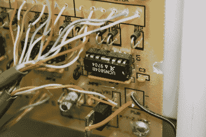

# 如何:在哪里找到项目的部件

> 原文：<https://hackaday.com/2007/11/16/how-to-where-to-find-parts-for-your-projects/>

寻找合适的零件通常比把所有东西焊接在一起要花更多的时间。我数不清我试图构建的项目的数量，也找不到一些不再制造的关键组件。你可以在最后帮忙列出一份供应商名单，但这样做的目的是有一个快速的参考来启动你的项目(为重要的事情省钱，比如浓缩咖啡)。即使你对常见的电子零件商店很熟悉，也要加入进来，帮我创建一份最佳供应商名单，为那些硬件黑客项目提供支持。

如果你想保住你的钱，我会尽量避免[无线电黑客](http://www.radioshack.com/category/index.jsp?categoryId=2032058)。当你因为找不到一个 10kω的电阻器而陷入困境时，这没什么，但他们低质量零件的价格高得离谱——他们的清仓价格还不算太低。尽管很多人在 RadioShack 上购物，但请记住，没有人会费事在偏僻的地方卖电子零件。

运输会比其他任何事情更快地消耗你的项目预算。这就是我有时愿意在 RadioShack 为 0.05 美元的电阻支付 1 美元的原因。当我购买零件时，如果可能的话，我会尽量从单一供应商处购买，以最大限度地利用我的零件预算。

大量储备零件有助于以后让项目更加实惠。购买一定数量的电阻、电容、PNP 和 NPN 晶体管以及一个合适的线性稳压器将会为你节省一大笔钱。我喜欢用一个原型板和一个奇怪的电容器的成本就能建造一个 30 美元的项目。

几乎每个电子元件制造商都会应要求提供免费样品。没错——免费。通常只需要在制造商的网站上创建一个帐户，然后选择你需要的组件。一般来说，我不会提及我为一个项目取样的时间。说真的，如果 100 个人突然取样完全相同的零件，他们会有点怀疑。样本不仅限于半导体公司。[ladyada]有一份[的样品供应商的好清单](http://www.ladyada.net/resources/procure/samples.html)，包括外壳和连接器。

[Digi-Key](http://digikey.com/) 搭载了你能想到的几乎所有部件。这些人喜欢大量销售，但他们也乐于接受小订单。订单发货很快，但如果你的订单低于 25 美元，他们会收取额外的 5 美元费用。即使你没有订购，他们通常会在网上提供每个零件的数据表。如果你愿意经历重重困难，你甚至可以创建一个可从你的网站链接的零件订单——这可以使与其他人共享项目变得更加容易，但我通常发现随着时间的推移，一些零件编号会被弃用。哦，他们会给你寄一份大的零件目录，方便你寻找零件和集思广益。

小毛电子公司是我最近最喜欢的供应商之一。他们有合理的运输选择，而且速度很快，UPS 地面订单会在两天内送到我家。他们的库存并不总是最好的，但替代零件通常很容易找到，因为在线目录从他们的打印目录链接到网络支持的 PDF 页面。这使得交叉引用变得非常容易。像 Digi-Key 一样，他们会给你发送一个巨大的零件目录，塞在你的显示器下面。

future LEC 是一个买到非常便宜的零件的好地方，但是大约一个月后你才会看到你的订单(好吧，所以我的最后一个订单在三周后才出现)。我建议储备连接器插头和电阻。多亏了这些人，我已经有几年没在深夜跑电阻器了。

Sparkfun electronics 就像是一个面向普通读者的糖果店。它们携带更高端的部件，如 GPS 单元、GMRS 模块和微控制器编程器。价格有点不同，但我总能在那里找到有趣的东西。如果你更喜欢专业制作的 PC 板，他们甚至会提供[廉价的 PC 板服务](http://www.batchpcb.com/)。

ebay 是我最喜欢购买零件的地方之一。这是一个花 20 美元购买全新的 150 美元的步进电机或寻找时髦的、可破解的硬件的好地方。人们当然试图销售单一组件，但通常不值得这样做。

零件回收是绝对最便宜的零件采购方式。由于定制的集成电路和表面贴装元件，新的电子产品通常没有多少残值。另一方面，旧硬件是零件的重要来源。我目前最喜欢的救助来源是点阵打印机。它们很容易拆卸，有很好的电源，装有优质的散热器、电线、连接器、硬化钢棒和步进电机。点阵打印机越大，步进电机越大。如果你能得到几个相同的模型，你最终会得到几套匹配的。人们讨厌扔掉它们，所以它们很容易免费得到。

供货不足可能是一个问题，但废弃零件是降低成本的另一种方式。最初，我在[切菜板数控机床](http://www.google.com/url?sa=t&ct=res&cd=1&url=http%3A%2F%2Fwww.engadget.com%2F2006%2F06%2F29%2Fhow-to-build-your-own-cnc-machine-part-1%2F&ei=xE8-R8CFM6HkigG2luSYCA&usg=AFQjCNGi60aiIoyo30Pr-kCT9c6GO_6rUQ&sig2=Tf2TT0if1rEBIC-fofLxzQ)上使用的 UCN5804B 步进驱动器每台价格约为 16 美元。现在它们被弃用了，每个大约 5 美元。

抢包是另一个省钱的好方法。它们通常充满了需要识别的松散部件，但它们很便宜。uchobby 的人整理了一份很好的分类指南。

由于从邮购到互联网供应商的转变，零部件公司的前景非常广阔。周围有很多生产部门和过剩的公司。这里有一个商店的快速列表，如果你正在寻找零件，可能会有用。

[Digi-Key 电子](http://digikey.com/)
[Mouser 电子](http://mouser.com/)
[Futurlec](http://www.futurlec.com)
[spark fun 电子](http://www.sparkfun.com)
[易贝](http://www.ebay.com)
[全电子](http://www.allelectronics.com/)
[BG 微](http://www.bgmicro.com/)
[美科&盈](http://www.sciplus.com/)
[金矿电子](http://www.goldmine-elec.com/)
[MPJA 在线](http://www.mpja.com/)

有最喜欢的商店吗？把链接放到评论里，我会把它添加到列表里。