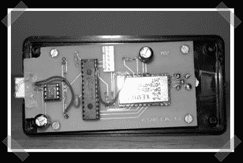

# 扩频跳频 USB 射频调制解调器

> 原文：<https://hackaday.com/2007/11/17/spread-spectrum-freq-hopping-usb-rf-modem/>

自从我在[零件寻找指南](http://www.hackaday.com/2007/11/16/how-to-where-to-find-parts-for-your-projects/)中提到 [Sparkfun 电子](http://sparkfun.com)后，我开始在他们的论坛上闲逛，偶然发现了[这个](http://www.raccoonrezcats.com/rfmodem.html)有趣的 USB RF 调制解调器。它使用现成的 Semtec DP1205 射频模块，由 PIC 18F2550 控制。真正有趣的是，它使用扩频跳频——这意味着根据 FCC 规则，它可以在 900Mhz 下传输高达 1 瓦的功率。

*   [永久链接](http://www.raccoonrezcats.com/rfmodem.html)