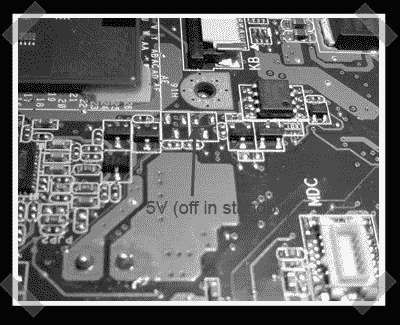

# 华硕 Eee 电脑追踪

> 原文：<https://hackaday.com/2007/11/20/asus-eee-pc-trace-hunting/>

还没有任何东西被侵入，但是【tnkgrl】花了一些时间[在她的](http://tnkgrl.wordpress.com/2007/11/20/modding-the-asus-701-eee/) [Eee PC](http://en.wikipedia.org/wiki/ASUS_Eee_PC) 周围寻找一些方便的可侵入的额外功能。我一直忽视他们，但现在我想要一个。哦，是的，我有。点击详细资料，但[tnkgrl]发现了一些半未使用的 USB 连接，一个可访问的 5v 电源和一个备用的迷你 pcie 插槽，似乎可以在使用时禁用 SSD。目前无法使用的 mini-pci 插槽实际上非常有趣。

*   [永久链接](http://tnkgrl.wordpress.com/2007/11/20/modding-the-asus-701-eee/)