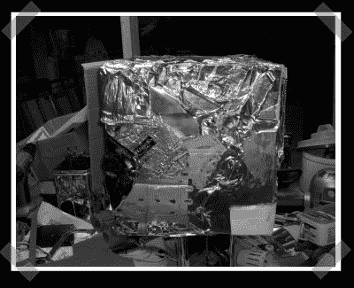

# 电影设计中的真实机器人

> 原文：<https://hackaday.com/2007/11/21/real-robots-from-movie-designs/>

多亏了*星球大战*，很多人都[建造了自己的](http://www.astromech.net/) R2 单位。皮克斯的下一部电影[已经发布预告片有一段时间了，已经有一个团队](http://www.apple.com/trailers/disney/walle/)(需要免费会员)致力于构建 SGI 机器人明星的真实版本:瓦力。我想我不得不称之为反向工程。WALL-E 有一些有趣的设计想法——它将垃圾压实成立方体，但它也可以将踏板收回到相同的压实区域。(图为瓦力风格的废物立方体，作者是[贾瓦人·伦克])感谢[香农]让我想到了这个。

*   [永久链接](http://www.wall-ebuilders.com/)