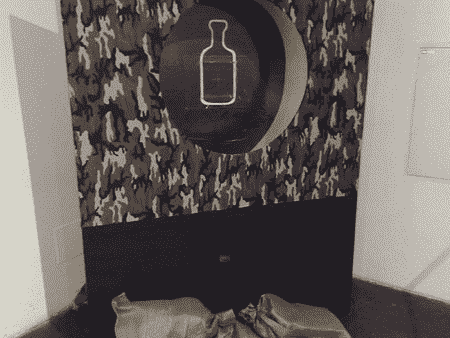
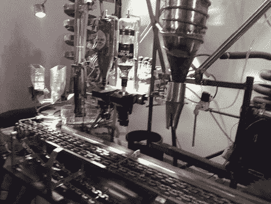

# Roboexotica 亮点

> 原文：<https://hackaday.com/2007/11/23/roboexotica-highlights/>

休息之后是目前为止我们最喜欢的来自 [Roboexotica](http://roboexotica.com/) 的一些机械零件。

To us the BF Ice Cube Gun, you first place your glass below the the target.

然后，你将冰块装入二氧化碳动力炮并开火。当它击中目标时，冰块破碎并落入玻璃中。如果你准确地击中目标，它也会将酒精倒入杯中。

[Robomoji](http://www.shifz.com/2006/10/featured-cocktailrobot-robomoji.html) 是常年的最爱。这个机器人笨重得令人难以置信，但在制作莫吉托鸡尾酒时看起来很有趣。它挤压酸橙，测量红糖，搅拌一切，甚至有一个组合制冰机/破碎机。

大会甚至拥抱酒吧食品机器人，永久的波普就是证明。该机器将爆米花放在凹面镜的聚焦点上，一次只爆一个玉米粒。整个单元充当定日镜本身朝向太阳。

虽然不是机器人，但最令人印象深刻的恶作剧来自供应商。monochrom 决定使用水泥搅拌机搅拌并供应螺丝刀。肖恩·邦纳为我们提供了它第一次和最后一次运行的视频(你会明白为什么)。

<object type="application/x-shockwave-flash" data="http://blip.tv/scripts/flash/showplayer.swf?enablejs=true&amp;feedurl=http%3A%2F%2Fseanbonner%2Eblip%2Etv%2Frss&amp;file=http%3A%2F%2Fblip%2Etv%2Frss%2Fflash%2F505033&amp;showplayerpath=http%3A%2F%2Fblip%2Etv%2Fscripts%2Fflash%2Fshowplayer%2Eswf" width="400" height="255" allowfullscreen="true" id="showplayer"><param name="movie" value="http://blip.tv/scripts/flash/showplayer.swf?enablejs=true&amp;feedurl=http%3A%2F%2Fseanbonner%2Eblip%2Etv%2Frss&amp;file=http%3A%2F%2Fblip%2Etv%2Frss%2Fflash%2F505033&amp;showplayerpath=http%3A%2F%2Fblip%2Etv%2Fscripts%2Fflash%2Fshowplayer%2Eswf"><param name="quality" value="best"></object><object type="application/x-shockwave-flash" data="http://blip.tv/scripts/flash/showplayer.swf?enablejs=true&amp;feedurl=http%3A%2F%2Fseanbonner%2Eblip%2Etv%2Frss&amp;file=http%3A%2F%2Fblip%2Etv%2Frss%2Fflash%2F505054&amp;showplayerpath=http%3A%2F%2Fblip%2Etv%2Fscripts%2Fflash%2Fshowplayer%2Eswf" width="400" height="255" allowfullscreen="true" id="showplayer"><param name="movie" value="http://blip.tv/scripts/flash/showplayer.swf?enablejs=true&amp;feedurl=http%3A%2F%2Fseanbonner%2Eblip%2Etv%2Frss&amp;file=http%3A%2F%2Fblip%2Etv%2Frss%2Fflash%2F505054&amp;showplayerpath=http%3A%2F%2Fblip%2Etv%2Fscripts%2Fflash%2Fshowplayer%2Eswf"><param name="quality" value="best"></object>
更多的照片一直被添加到 Flickr 。