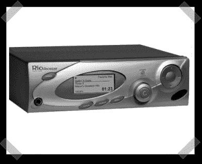

# Rio 接收机 SLIMP3 仿真器

> 原文：<https://hackaday.com/2007/11/23/rio-receiver-slimp3-emulator/>

【Roo】让[把这个](http://empeg.org.uk/slimrio/index.html)送进来，我花了几分钟才看出来一个不推荐的数字音频播放器有什么好感兴趣的。Rio 接收器最初售价约为 350 美元。今天它是一个死产品，但由于一些软件模块，它可以被黑客攻击，以获得 SLIMP3(又名 [Squeezebox](http://www.slimdevices.com/pi_squeezebox.html?) )播放器的能力。所以在易趣上买一个这样的小玩意，多亏了为播放器修改的内核和 linux 盒子上的一些软件，你就可以把旧的 Rio 接收器变成一个 SLIMP3 模拟器。

*   [永久链接](http://empeg.org.uk/slimrio/index.html)