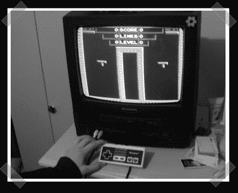

# 控制器中的 NES 与墨盒兼容

> 原文：<https://hackaday.com/2007/11/29/nes-inside-a-controller-with-cartridge-compatibility/>

【托尼】派[这个](http://forums.benheck.com/viewtopic.php?t=14764)任天堂黑掉了。这是一个功能齐全的 NES，在一个旧的学校控制器内有复合输出。在背面，它有一个盒式连接器，所以你可以玩正常的游戏，有一个端口用于第二个播放器/光枪，为了更加闪亮，任天堂的标志是背光的。为了实现这一目标，他在控制器内部塞了一个 Super Joy III，也就是 famiclone，对盒式磁带连接器进行了马拉松式的焊接，并使用现在未使用的控制器导线来传输视频和第二控制器信号。

是的，这已经有一段时间了，但我喜欢它。

*   [永久链接](http://forums.benheck.com/viewtopic.php?t=14764)