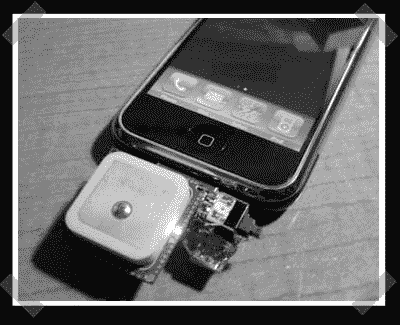

# IPhone GPS 模块

> 原文：<https://hackaday.com/2007/12/14/iphone-gps-module/>

[engadget](http://www.engadget.com/2007/12/14/not-all-is-lost-partfoundry-developing-gps-module-for-iphone/)的小伙子们在我整理它的时候把它放了出来，但我还是会打它。[科特]送来了他组装的 [iPhone GPS](http://partfoundry.com/iphonegps.html) 。他使用微控制器发送我们在 iPhone 系列教程中提到的地面触发握手，以及一个小的 NMEA 串行 GPS 模块。握手完成后，控制器将串行端口移交给 GPS 输出。(由于握手只需要接地切换，我猜测该模块一直连接到 TX/RX 线路。)对了，GPS 看起来像是 [spark fun electronics](http://www.sparkfun.com/commerce/product_info.php?products_id=575) 卖的这个 SiRF II 板。

*   [永久链接](http://partfoundry.com/iphonegps.html)