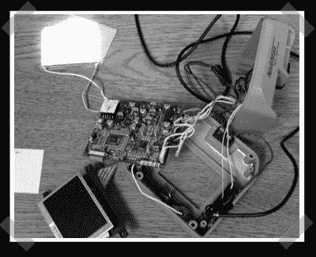

# 夜视汽车平视显示器

> 原文：<https://hackaday.com/2007/12/17/nightvision-car-heads-up-display/>

【alti】想要[为他的车配备夜视](http://www.mp3car.com/vbulletin/hardware-development/73549-project-nitevision-nitemax-hud-carputer.html)，所以他买了一个内置 LCD 的 nightmax 夜视摄像头。该计划是安装显示器，以便它能反射他汽车的挡风玻璃，从而创建一个简单的 HUD。不幸的是，图像从挡风玻璃的内部和外部反射回来。论坛上的讨论越来越长，但这是一个有趣的项目。

*   [永久链接](http://www.mp3car.com/vbulletin/hardware-development/73549-project-nitevision-nitemax-hud-carputer.html)