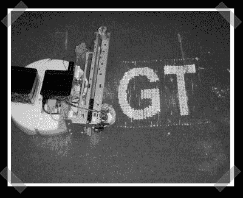

# 爽身粉打印机器人

> 原文：<https://hackaday.com/2007/12/20/talcum-powder-print-bot/>

[我们已经有一段时间没有看到新的印刷机器人创意了](http://www.hackaday.com/2006/10/08/inker-the-hand-inkjet/)。[凯尔]送来了[他的小组在佐治亚理工学院的](http://users.ece.gatech.edu/~hamblen/489X/F07PROJ/Printerbot/index.html)期末项目。一个非常方便的 iRobot 底盘，一个点阵打印机托架和一个漏斗中的电动钻头战略性地分配滑石粉，以在地板上打印信息或图像。想象一下，一个机器人可以在地板上写字，而另一个机器人可以事后清理。一些体育爱好者要多久才能在大型比赛前造出一个更大的来破坏足球？

*   [永久链接](http://users.ece.gatech.edu/~hamblen/489X/F07PROJ/Printerbot/index.html)