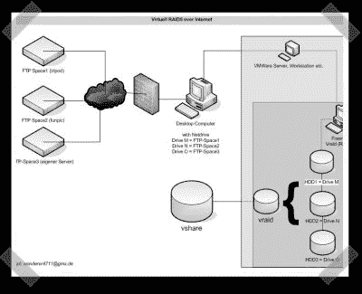

# 虚拟 Raid 5 互联网存储

> 原文：<https://hackaday.com/2007/12/22/virtual-raid-5-internet-storage/>

【wonder】发送了一份[有趣的](http://home.arcor.de/webknight23/)概念验证，介绍如何设置虚拟 raid 5 驱动器，使用免费的 ftp 服务器存储数据。这项技术有点绕弯，但他说它工作得相当不错。这些共享使用 netdrive 装载在 windows 下，然后被 VMware 下的 FreeNAS 突袭。我自己没有试过，但我可能会尝试做同样的事情，但使用 [LUFS](http://freshmeat.net/projects/lufs/) ，在一个操作系统下做所有的事情。

*   [永久链接](http://home.arcor.de/webknight23/)