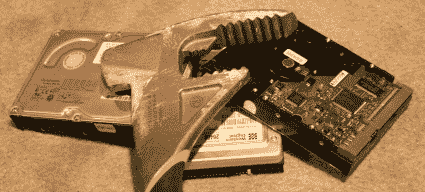

# 假日黑客:自动硬盘销毁

> 原文：<https://hackaday.com/2007/12/25/holiday-hackit-automated-hard-drive-destruction/>

我们[最近的一篇](http://www.hackaday.com/2007/12/22/virtual-raid-5-internet-storage/)帖子提到了一个有趣的话题:物理硬盘破坏。首先，[狼]想在他的硬盘上使用一个 20ga 的猎枪弹壳。[brk]建议在驱动器还在旋转的时候用一个电磁铁。每个人都认为[铝热剂](http://en.wikipedia.org/wiki/Thermite)可能会很有趣……最后，【狼】注意到[这种](http://www.deadondemand.com/products/enhancedhdd/)商用自动销毁驱动器会让自己充满酸雾。我会提出一些想法，让你们从那里开始。

我建议将两部分环氧树脂气动注入驱动机构。使用 [diy 洁净室](http://www.hackaday.com/2004/11/08/make-a-clear-hard-drive/)方法移除外壳顶部，添加环氧树脂端口，并使用廉价的 CO2 自行车注射器按需将液体注入驱动器。
 *那么，有更好的主意吗？说来听听。*