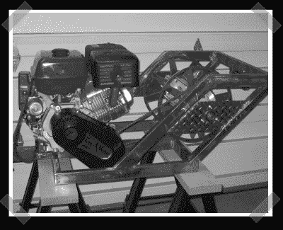

# DIY 滑水绞车

> 原文：<https://hackaday.com/2007/12/28/diy-wakeboarding-winch/>

【吐气地兹】只是[中的一个](http://wakeboarding-winch.com/viewtopic.php?t=314)建造了自己的尾波绞车的家伙。这些东西技术含量很低，但是用绞盘来滑水是我最近见过的最有创意的想法之一。绞盘比船有一些有趣的优势:更少的燃料，没有许可证，浅水区，没有船或摩托艇可以在那里工作突然变得可用。这里有一个典型的[基本](http://wakeboarding-winch.com/viewtopic.php?t=13)设计和一个简单的演示[视频](http://www.youtube.com/watch?v=ujc21hv3FQw)。在论坛上搜索信息有点烦人，所以这里有一篇[精彩的](http://www.tahitimx.com/winch/) winch 构建文章。

*   [永久链接](http://wakeboarding-winch.com/viewtopic.php?t=314)