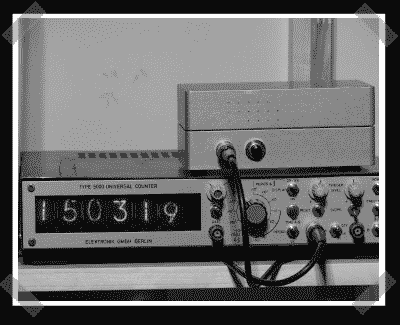

# 谢妮计数钟

> 原文：<https://hackaday.com/2008/01/05/nixie-counter-clock/>

【勒尼恩九头蛇】送来了[他版本的](http://www.lerneaenhydra.net.nyud.net/index.php?option=com_content&task=view&id=33&Itemid=28)无处不在的谢妮钟。他没有在计数器里装电子管，而是用 Atmel Mega88 脉冲时钟来显示时间。此外，表壳上的 LED 矩阵以二进制输出时间。他过去的项目值得一查。他在改装过的[数控铣床](http://www.lerneaenhydra.net/index.php?option=com_content&task=view&id=25&Itemid=28)上加工表壳，改装了一台旧的[数控车床](http://www.lerneaenhydra.net/index.php?option=com_content&task=view&id=15&Itemid=28)，似乎很喜欢在[所有东西](http://www.lerneaenhydra.net/index.php?option=com_content&task=view&id=27&Itemid=28)(包括他的时钟)上安装超级电容。

*   [永久链接](http://www.lerneaenhydra.net.nyud.net/index.php?option=com_content&task=view&id=33&Itemid=28)