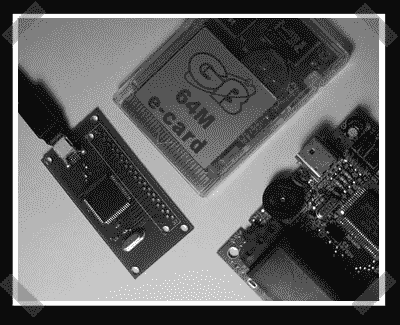

# USB 传输器(又名 USB Gameboy 卡接口)

> 原文：<https://hackaday.com/2008/01/10/usb-transferer-aka-usb-gameboy-card-interface/>

【何塞】送来了他努力打造的 [USB 传输器](http://8bitcollective.com/forums/viewtopic.php?id=1916)。我很确定是基于 Atmel AT90USB647 AVR 微控制器的 gameboy flash 卡带接口。一旦原型板来了，他焊接控制器，掏空一个旧游戏机的墨盒连接器，并在一天结束时让设备出现在他的 PC 上。奇怪的是，他连接的卡是一个独立的 USB 设备。在更多的细节公布之前，我会假设这个接口不仅仅是用来连接特定的卡。

*   [永久链接](http://8bitcollective.com/forums/viewtopic.php?id=1916)