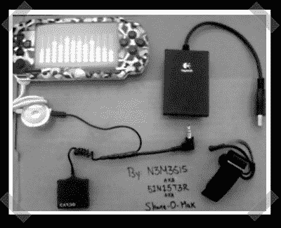

# 适用于 PSP/PS2 的蓝牙耳机

> 原文：<https://hackaday.com/2008/01/15/bluetooth-headset-for-pspps2/>

【谢恩】组装[这款](http://www.instructables.com/id/Bluetooth-PSPPS2-Headset-Mod/)时髦的蓝牙耳机，这样他就可以在 PSP 和 PS/2 上使用耳机。它始于一个 Cardo 蓝牙适配器。他在定制的尾纤上添加了一个 PSP 耳机式连接器和一个标准的 2.5 毫米插头。然后，他可以使用 PSP 耳机遥控器或修改后的 USB PS/2 耳机适配器。

*   [永久链接](http://www.instructables.com/id/Bluetooth-PSPPS2-Headset-Mod/)