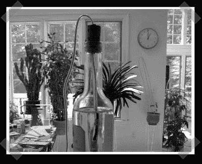

# 酒窖监控

> 原文：<https://hackaday.com/2008/01/17/wine-cellar-monitoring/>

我一直在调酒，偶然发现了[这个](http://owfs.org/index.php?page=monitor-a-wine-cellar)得心应手的一根丝酒窖监视器。除了通常的 iButton 空气温度传感器，他们还建造了一个简单的浸入式 [18S20](http://www.maxim-ic.com/quick_view2.cfm/qv_pk/2815) 传感器来监控液体温度。(我会在水中扔一些亚硫酸盐以防发霉)为了监视空气状况，他们使用了一个 [TAI8540A](http://www.aagelectronica.com/aag/en-us/dept_2.html) 湿度探头。看起来就像是极客酒窖里的东西。

*   [永久链接](http://owfs.org/index.php?page=monitor-a-wine-cellar)