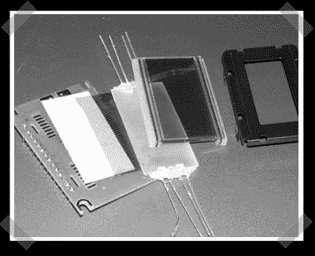

# 背光你的液晶显示器

> 原文：<https://hackaday.com/2008/01/20/backlight-your-lcds/>

【阿图尔】[发来了这份](http://www.instructables.com/id/DIY-LCD-backlight/)说明书，展示如何为液晶显示器制作自己的背光。这是一个简单的过程，但鉴于背光液晶显示器的成本差异，我认为它值得一些关注。如果你正在建造自己的投影仪并考虑去掉偏光膜，这也是一个很好的练习。

*   [永久链接](http://www.instructables.com/id/DIY-LCD-backlight/)