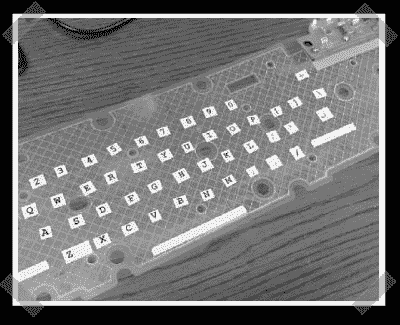

# 制作你自己的卷起键盘

> 原文：<https://hackaday.com/2008/01/24/make-your-own-roll-up-keyboard/>

【奥格】[派来的这个](http://www.instructables.com/id/Make-your-own-Roll-Up-Keyboard/)不错的小黑客。说明书上说要准备一个 USB 键盘(我觉得它看起来像戴尔的 USB 键盘)，把它们连在一起后，把它挖空，贴上里面的柔性薄膜。如果你有这种风格的键盘供应，这可能是一个便宜的来源…或者更好的是，也许你可以使用胆量生产高质量的定制钥匙扣。

*   [永久链接](http://www.instructables.com/id/Make-your-own-Roll-Up-Keyboard/)