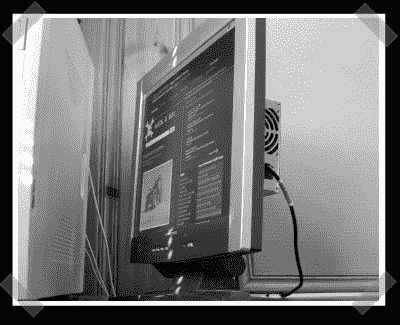

# 更换您的 LCD 电源

> 原文：<https://hackaday.com/2008/01/27/replace-your-lcd-power-supply/>

【电脑大师】的 LCD 电源没电了，变成了一堆没用的塑料。他用一台旧的 PSU 电脑替换了有缺陷的那台。在他确定了内置电源的输出(我拆开的那个被贴上了标签)后，他拆下了替换的 PSU 来提供必要的电压。

*   [永久链接](http://computerguru365.blogspot.com/2008/01/fix-that-lcd-flat-panel-monitor.html)