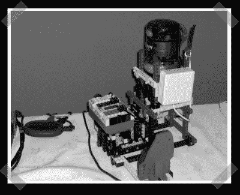

# 启用网格的 USB 显微镜

> 原文：<https://hackaday.com/2008/01/29/grid-enabled-usb-microscope/>

【乔克】[发来的这张](http://gallery.combe.chem.soton.ac.uk/Lego_Post)照片展示了一台乐高思维风暴自动显微镜。我翻出了[发表的关于这次黑客攻击的论文](http://eprints.soton.ac.uk/45432/),想知道这个想法到底是什么。这是一个展示自动化数据收集的概念验证 Mindstorms 用于允许英特尔 QX3 显微镜在网格区域内采集数据。这是一个收集时间序列数据的有趣想法。计算机界面有点过于复杂，但是乐高使得业余机器人专家也能完成这种项目。

*   [永久链接](http://gallery.combe.chem.soton.ac.uk/Lego_Post)