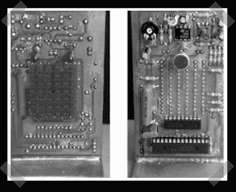

# Tengu Clone Redux

> 原文：<https://hackaday.com/2008/01/31/tengu-clone-redux/>

还记得[开源天狗克隆](http://www.hackaday.com/2007/10/22/tengu-clone/)吗？[jfmateos2]在他的版本中发送，带有为生日礼物设计的定制蜡烛游戏。这是一个很好的工作，我喜欢它当我们激发新的项目！他发来了一篇关于他添加的功能的精彩评论，所以我决定全文发布:

[大家好，我的昵称是 jfmateos2，这个视频[http://www.youtube.com/watch?v<wbr>= mnfp 4 fnve-I](http://www.youtube.com/watch?v=MnFP4FNVE-I)是关于我上一个致力于 PIC 微控制器的项目的简要介绍。

这部影片是西班牙语的，但有英语字幕。当我第一次在 Hackaday 博客上看到 Alex 开发的克隆天狗时，我认为这是一个学习使用 PIC 微控制器特定功能(如 A/D 转换器、中断和定时器)的合适项目。在研究了 Crispin Jones 开发的原始 Tengu 的特性后，我开始指定我自己的克隆体的需求。我决定包括一个基本的游戏，打算把它变成一个个性化的生日礼物；我姐姐的生日快到了。

它的使用非常简单。将 PIC-Tengu 连接到 USB 端口后，它将进入睡眠状态。吹在它的脸上，它就会醒来。然后 PIC-Tengu 打哈欠，当且仅当这是我们第一次使用它时，它将开始蜡烛游戏。这个游戏的目的是一根接一根地吹灭蜡烛，所以如果被尊敬的人超过了一定的年龄，它会变得相当无聊，尽管没有拉他/她的耳朵那么痛苦。还好妹妹才 25 岁。游戏结束时会出现个性化的滚动消息。接下来，PIC-Tengu 开始模仿它听到的每一个声音。有四种脸型可供选择:鹰钩鼻、塌鼻子、无鼻子和卢西亚诺。活跃的一组面随着风或强噪声而改变。Pic-Tengu 的听觉敏锐度可通过后面的电位计进行配置。按下此按钮可在模仿模式和滚动消息模式之间切换。如果我们保持按下按钮超过 2 秒，PIC-Tengu 将重置，恢复到以前从未使用过的状态；这暗示着蜡烛游戏会在唤醒它之后再次出现。
 最后，如果在模仿模式下超过 5 分钟没有任何活动，PIC-Tengu 将进入睡眠状态。这个项目的大脑是 PIC18F2455，其引脚直接激活 led 矩阵的行。在任何给定时刻，只有一个 LED 列处于活动状态，这也是由 PIC18F2455 s 引脚决定的，但这次使用的是中间器件 ULN2803。麦克风捕获的信号在到达 PIC 中的模拟输入之前，使用 LM358 进行放大。固件是用 CCS C 写的，PIC 是用并行端口版本的 GTP Lite 和 WinPIC800 烧的。在[www.villatic.org/carpetaJuanfe<wbr>/pictengu . rar](http://www.villatic.org/carpetaJuanfe/pictengu.rar)可以下载电子原理图、PCB 原图、源代码和编译好的固件。任何进一步的信息将在[www.todopic.com.ar/foros](http://www.todopic.com.ar/foros)论坛发布。
欢迎大家在 [jfmateos@lycos.es](mailto:jfmateos@lycos.es) 提出意见和建议

*   [永久链接](http://www.villatic.org/index.php?option=com_content&task=view&id=87&Itemid=2)