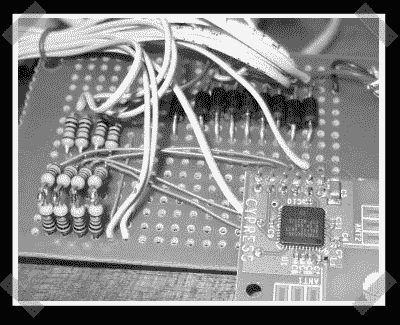

# DIY 2.4ghz 频谱分析仪

> 原文：<https://hackaday.com/2008/02/14/diy-24ghz-spectrum-analyser/>

[这个](http://www.wireless.org.au/~jhecker/specan/)项目去年得到了一些博客的喜爱，但它逃过了我的雷达。[jhecker]基于 Cypress 2.4ghz 收发器模块构建了一个并行端口接口设备。这个模块相当完整，所以只要你能挥动烙铁，你就能完成这个。该模块非常便宜，因此它可能正是构建您自己的信号检测器的好东西。

【编辑注，Stardate 2018:似乎有些 linkrot。[改为尝试此链接](https://web.archive.org/web/20080226112749/http://www.wireless.org.au/~jhecker/specan/)。]

*   [永久链接](http://www.wireless.org.au/~jhecker/specan/)