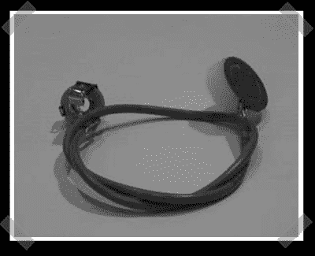

# 便宜的 DIY 木吉他拾音器

> 原文：<https://hackaday.com/2008/02/22/cheap-diy-acoustic-guitar-pickup/>

我偶然发现了[这个](http://www.instructables.com/id/Acoustic-Guitar-Pickup/)简单，但有效和便宜的 diy 吉他拾音器，在我寻找有趣的窍门的时候。压电元件让我惊叹不已。它们可用于电子[架子鼓](http://www.hackaday.com/2005/08/02/homemade-drum-triggers/)，水下麦克风[，跑鞋](http://www.hackaday.com/2007/01/23/nike-ipod-hacking/)和音乐贺卡。

(我只找到一本关于水听器的旧的、绝版的书，所以如果你有好的参考资料，[发送到](http://hackaday.com/tips)。)

*   [永久链接](http://www.instructables.com/id/Acoustic-Guitar-Pickup/)