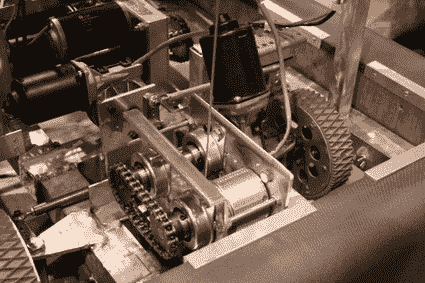
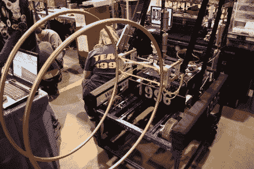
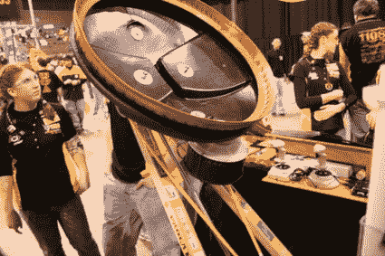
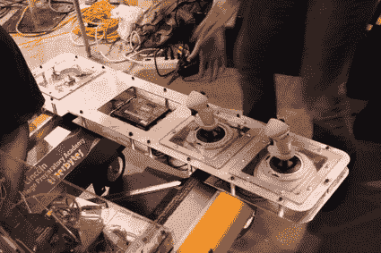
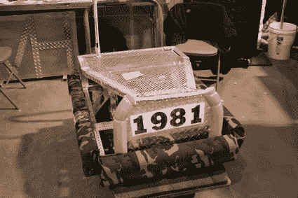
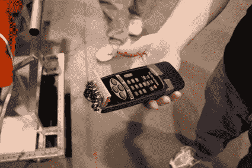
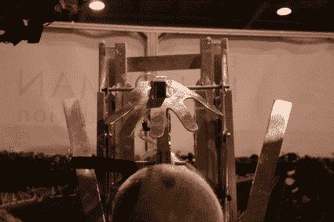
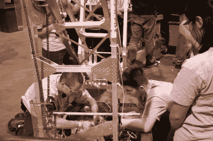

# 第一届机器人区域赛–KC–2008

> 原文：<https://hackaday.com/2008/03/07/first-robotics-regional-kc-2008/>

当你在门口拿到安全眼镜时，你知道这将会很有趣。如我所承诺的，我今天要去堪萨斯城参观第一个机器人区域。竞争相当激烈——没有火焰投掷战斗机器人那么激烈，但是孩子们已经组装了一些非常严肃的机器人。

请继续阅读比赛的更多图片。

大多数机器人都有相同的基本设计特征——主要是因为每个团队都有一套库存零件。我花了大部分时间在维修站访问团队——检查他们的设计，问他们机器人最喜欢的部分是什么。

【2385 队】——莱特基督学院是我第一次去的地方之一。他们用一辆货车上的一些电动门马达建造了自己的高扭矩转向系统(和绞盘驱动)。它们看起来和老式的雨刷马达差不多。他们在联动装置中添加了一个线性电位计，以创建自己的超级伺服系统。我可能会在我未来的一个项目中重新创建这个。

【Team 1996】为他们的机器人想出了这个有趣的抓手。机械臂可以上下移动，但是手爪有一个静态链传动装置来保持水平。

【1108 队】打造了一个最具娱乐性的机器人来观看比赛。手臂是一个弹射器，但它的顶端有一个垃圾桶盖，上面有一个手工缝制的橡胶密封。正下方是一个来自商店 vac 的风扇组件——但交流电机被 DC 装置取代。它出色地捡起了大球，并用手臂将其发射出去。

过了一会儿，我发现他们正在调弹弓。它只是发射了球，就差一点钉死那个直接站在路上的家伙了。

【1775 团队】为他们的 bot 组装了这个甜蜜的控制板。控件是标准配置，但大多数团队都满足于将它们安装在一块木头上。

【Team 1981】不得不在最后一刻废弃他们的气动臂，所以他们满足于让他们的机器人短而结实。据我所知，他们只是用机器人推着球尽可能快地绕着跑道跑，就能相当体面地得分。

在自主比赛中，一个队需要为他们的红外遥控器增加一点射程。命令 1-3 告诉机器人目标球需要哪个槽。发送 4 会杀死所有东西。(关，不是所有人类。)

【Team 2164】建造了这个铝制的手形抓手。它看起来棒极了，但我还没有看到它的动作，但它看起来棒极了。

我喜欢这个小小的建筑技巧。该框架是由流行铆接铝板加入结构。我不知道它会有多耐用，但它看起来是一种加快建设速度的好方法。

我没有机会和我想和的每个团队交谈，他们都非常努力。当他们试图解决问题或让机器人准备运行时，你不能错过这个活动。如果你有机会去看第一场比赛，好好利用它。