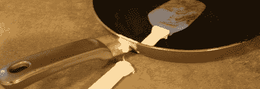

# 半复制额外帖子

> 原文：<https://hackaday.com/2008/03/22/semi-duplicate-post-extra/>

[bgugi]第一个注意到昨天的帖子以前被看过，藏在去年的一个号外里。(我确实检查过这些东西，但它溜走了。)我为我的小失误感到荣幸，这是一个满载的额外津贴。

[Matt]在当地的一个垃圾箱旁边找到了一些有趣的硬件。他也刚刚展示了[他的线圈枪](http://matthack.com/category/coil-gun-v20/)的第一部分，它是基于 10 个 1 美元的一次性相机。

[Darren]发送了这个安装在佳能 FX 单反相机机身上的 USB 网络摄像头。现在，凸轮可以安装旧的(便宜的)镜头，以获得更好的性能。

[Brandon]非常喜欢他的 XBox live——足以通过 Sprint EVDO 设置访问权限，并在他的 Mini Cooper 中安装所有东西，手套箱中有一套 VR 眼镜和控制器，可以即时访问。

这一周到处都是这些，但我想把它们放在那里。向 BoingBoing 展示了支持 RFID 的信用卡有多差劲。看这只狗玩他自己的[机器人投球手](http://www.youtube.com/watch?v=4PcL6-mjRNk)真是太有趣了。

[Jason]把他的 [altoid 锡吉他](http://www.instructables.com/id/Altoids-Tin-Guitar/)送了进来——他在锡里面放了一个压电元件来获取信号。

[大卫]送来了他的旧的，但仍然很棒的机器人。这是一个平衡机器人，通过无线调制解调器控制，带有摄像头反馈。

最后也是最重要的一点，[Basil]提交了他的 midi strip 吉他模型。他在吉他主体上添加了一个电容触摸条，并使用它来创建 midi 输出。查看演示视频[这里](http://www.youtube.com/watch?v=UgNpM_mwaO8)，这里[这里](http://www.youtube.com/watch?v=V1PqpYbI20k)和[这里](http://www.youtube.com/watch?v=9lCNwfxVwG8)。