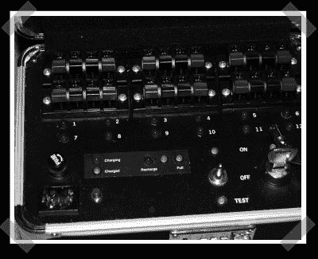

# 无线烟花控制器

> 原文：<https://hackaday.com/2008/03/24/wireless-fireworks-controller/>

【塔基】送来了他的[无线烟花控制器](http://tuckie.net/wordpress/2008/03/23/diy-wireless-firework-control/)。电子部件是现成的——12 通道继电器板和遥控器提供了勇气。他用一个岩石滚磨机研磨制造雷管所需的黑火药。精细研磨的黑火药、镍铬合金线和乒乓球的组合构成了每个雷管的商业端。当用遥控器选择一个频道时，继电器被激活，电流被发送到绑在烟花保险丝上的雷管。

*   [永久链接](http://tuckie.net/wordpress/2008/03/23/diy-wireless-firework-control/)