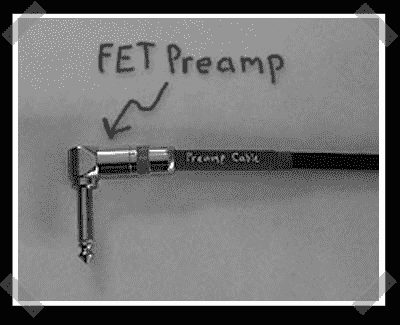

# 有线吉他前置放大器

> 原文：<https://hackaday.com/2008/03/29/in-cable-guitar-preamp/>

【布莱恩】[派来了这个](http://www.till.com/articles/PreampCable/index.html)古老却出色的吉他线缆黑客。[J. Donald Tillman]设法将基于 fet 的前置放大器安装在吉他线缆的 1/4”连接器内。它是幻像供电的——所以它会从声卡/混音器中吸取能量。我只是对他把东西放在里面印象深刻。

另一方面，[这个](http://www.engadget.com/2008/03/29/hackers-embed-flashing-animations-on-epilepsy-support-forum/)是那种给黑客带来坏名声的垃圾。我希望幕后黑手最终成为 Soylent Green。

*   [永久链接](http://www.till.com/articles/PreampCable/index.html)