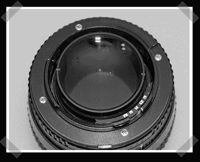

# 定制安装手动美能达/索尼镜头

> 原文：<https://hackaday.com/2008/04/03/custom-mounting-manual-minoltasony-lenses/>

我们通常会收到[佳能的改装](http://www.hackaday.com/2006/12/30/diy-canon-lenses/)，但是【polossatik】给[发来了一些](http://www.dyxum.com/dforum/forum_posts.asp?TID=29279)由【Shaocaholica】制作的有趣的索尼/美能达镜头改装作品，他们真的将镜头改装提升到了一个新的质量水平。他拿起几个旧的 Rokkor F1.2 镜头，交换零件，制成四个像样的镜头。然后，他让[皮特·甘茨] [在他的车床上调低](http://www.pbase.com/pganzel/modification_of__58mm_f12_rokkor)一些新的底座。最后，一轮快速环氧树脂添加镜头 id 芯片激活板上图像稳定和焦点确认。请务必点击查看照片制作日志[。](http://shaozhang.smugmug.com/gallery/4630693_jPsbU#273263748)