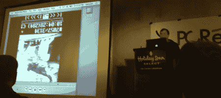

# 2008 年航行通告:美国运输安全管理局 Bagcam

> 原文：<https://hackaday.com/2008/04/06/notacon-2008-the-tsa-bagcam/>

【algormor】在 [Notacon](http://notacon.org/) 做了一个更有争议的演讲。在收到一些过多的检查单和被毁坏的行李后，他决定找出幕后发生的事情。首先，他从沃尔玛(Walmart)购买了一个带有拉链衬里的廉价包。为了录制视频，他购买了一台[斯旺加德微型录像机](http://www.swann.com.au/s/products/view/?product=494)。它是一个手掌大小的设备，可以录制 128×128 的 15fps 视频。它带有一个塑料盖，他把塑料盖安装在包的里面。徽章架正上方有一个摄像头孔。由于相机是运动触发的，他可以向上滑动徽章，盖住洞，以停用相机。他至少带着这个包走了四趟。那么…录像显示了什么？

嗯，很多传送带，传送带，传送带。没什么大不了的。它确实显示了在被检查之后和安检之前，这个包在公共场所度过了一段令人不舒服的时间。它还花时间多次穿过某些部分，在随机的时间段内被拉离传送带，然后又被放回传送带。观众们担心他可能会触犯联邦法律，因为他在无人知晓的情况下录制音频。令人惊讶的是，这个包还没有被搜查过。