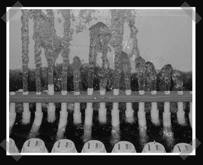

# H2O 频谱分析仪

> 原文：<https://hackaday.com/2008/04/07/h2o-spectrum-analyser/>

【Ray】注意到频谱分析仪已经成为 FPGA 评估人员最喜欢的项目，并在[his group](http://4006.iceglow.com/)中发送了 2004 年的版本。他的团队使用 MatLab、Altera FPGA 和 16 个泵的组合来产生实时声谱输出。

*   [永久链接](http://4006.iceglow.com/)