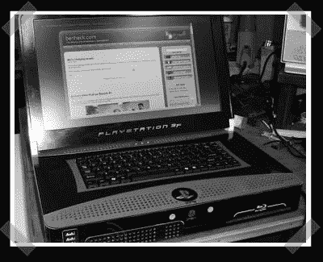

# 本·赫克的 PS3 笔记本电脑

> 原文：<https://hackaday.com/2008/04/10/ben-hecks-ps3-laptop/>

【本】又来了。这次他拿出了一台 PS3 笔记本电脑。他专门为 [engadget](http://engadget.com) 造了这个……上面会有操作指南，哦，是的，会有的。现在，你可以用[图片库](http://www.engadget.com/photos/the-ps3-laptop-from-ben-heck-to-engadget-with-love/745991/)来满足你对主机改装的胃口。它相当大，但实际上比原来的主机更薄。

*   [永久链接](http://www.engadget.com/photos/the-ps3-laptop-from-ben-heck-to-engadget-with-love/745991/)