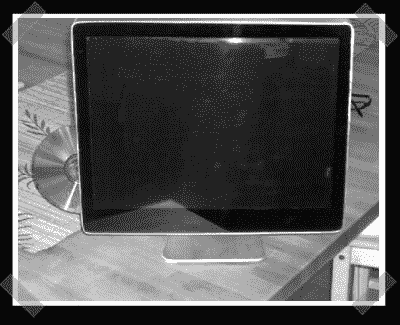

# DIY IMac Mini

> 原文：<https://hackaday.com/2008/04/14/diy-imac-mini/>

【Phyro-Mane】在[他的](http://www.case-modder.de/wbb/modding-forum/ein-case-mod-entsteht/p323497-pm-imacmini/#post323497)家里造了 iMac mini。他基于一台旧笔记本电脑，安装了苹果主题的 ~~OSX86~~ XP。论坛是德语的，但是帖子里的照片说明了一切。

*   [永久链接](http://www.case-modder.de/wbb/modding-forum/ein-case-mod-entsteht/p323497-pm-imacmini/#post323497)